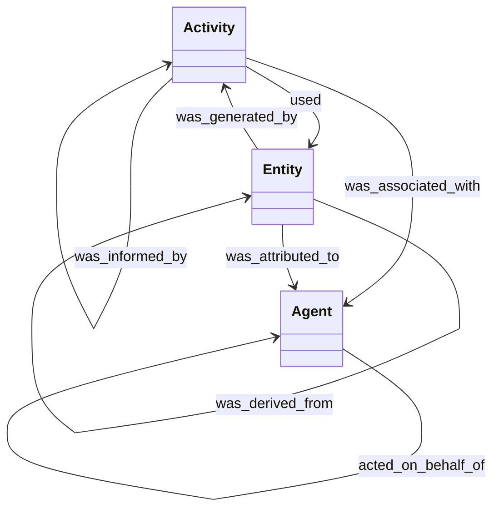
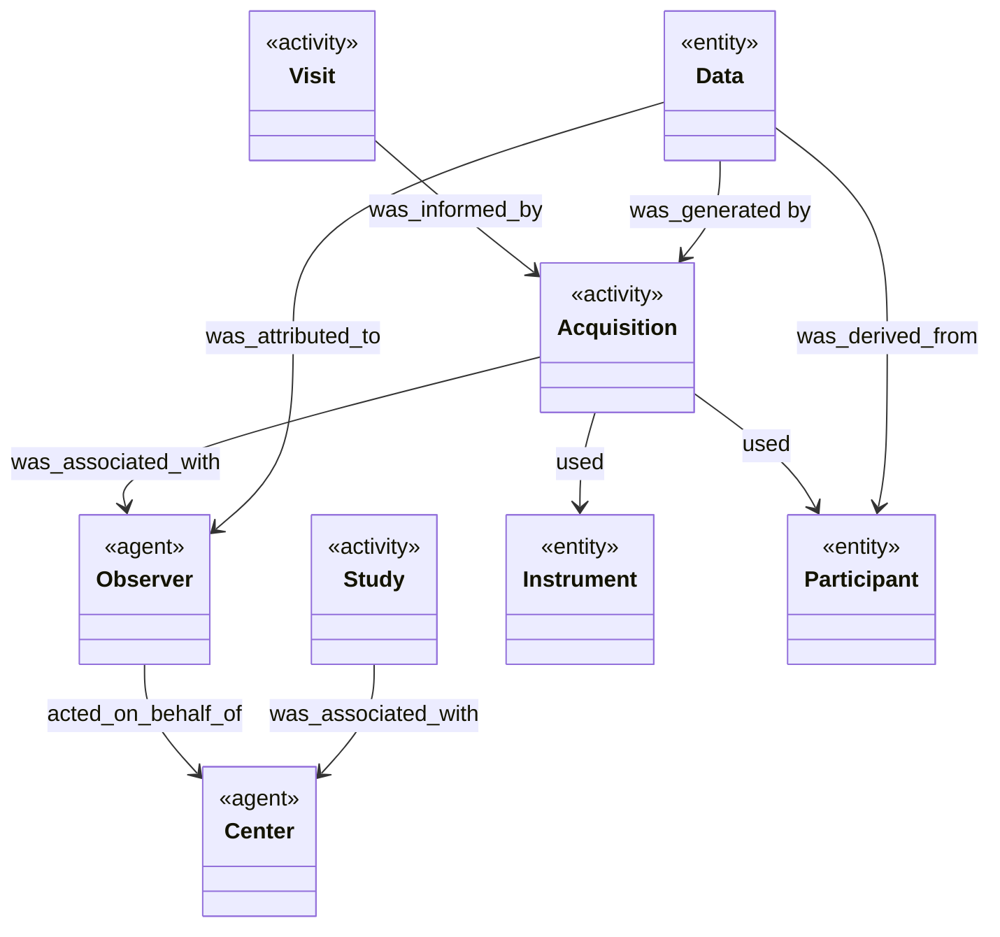
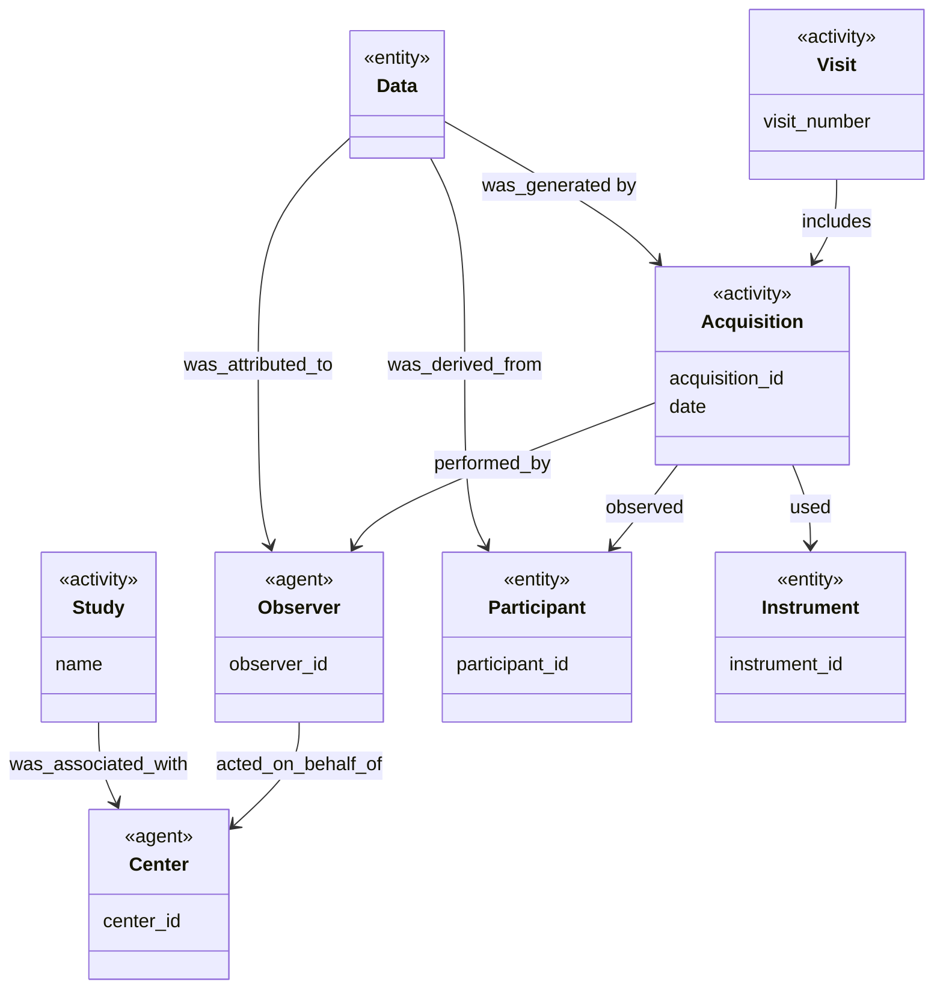

# Metadata

The following explains the design of the metadata used to describe data collections to be submitted to NACC.

The goal for the metadata given in NACC submissions is to reflect the provenance of the data that is submitted.
The *provenance* of a data file is a record of how that data was captured and the relationships describing that record.

## Provenance

We use the [PROV-DM](https://www.w3.org/TR/prov-dm/) model for describing provenance.
The objects in the model are *agents*, *activities* and *entities*.
Agents represent people, organizations or systems that perform activities that use an generate entities.



Rather than go into detail on the relationships in the model, we describe the relationships we need for modeling the provenance of a data collection.

## Modeling Data Provenance

We want to model the following

> During a <ins>visit</ins> of <ins>participant</ins> to the <ins>center</ins> for a <ins>study</ins>, an <ins>Observer</ins>, acting on behalf of the <ins>center</ins>, performed an (<ins>acquisition</ins>) activity that generated the <ins>data file</ins>

This sentence has the following concepts

|Concept|Provenance Type|Description|
|-------|---------------|-----------|
|Study|Activity|The research activity for which data was collected|
|Center|Agent|The site where data was collected|
|Observer|Agent|The person who collected the data|
|Participant|Entity|The person observed to collect the data|
|Visit|Activity|The participant's visit to the center for data collection|
|Acquisition|Activity|An individual collection of data|
|Instrument|Entity|The instrument/mechanism used to collect data|
|Data|Entity|The data collected by an acquisition

And, mapping to the PROV-DM model we get the following class diagram



Some of the PROV-DM relationship names are a bit awkward when talking about humans, so we change them:

|Object|Object|Provenance Relationship|Otherwise known as|
|------|------|------------|--------------|
|Acquisition|Observer|was_associated_with|performed_by|
|Acquistition|Participant|used|observed|
|Visit|Acquisition|was_informed_by|includes|
|Visit|Participant|used|observed|

We want to be able to identify instances of each of the concepts, and so add IDs to all but the `Data` concept.
These changes yield this model:



This model isn't meant to constrain the attributes, and others should be added to communicate more detail about how the `Data` was collected.
Also, in some cases the attributes might not make sense -- an electronic form will have a name and version, but each instance will not have an identifier.
So, the model should be adjusted to the circumstance.
Where possible identifiers should be URIs rather than database idenfiers.

## Mapping to Metadata

We want the metadata to reflect this information in context.

NACC ultimately stores data using the following hierarchy

```bash
Center
└── Study
    └── Participant
        └── Visit
            └── Acquisition
                └── Data
```

So, minimally, we need the information to derive this relationship for particular data.

### On identifying studies

Much of the data that is collected by NACC is for the ADRC program, and the study hasn't historicially been captured within the data.
We assume that data is submitted in the context of a particular study and so the study can be understood.

However, the study is a short-hand for the participant consent with subsequent limitations on use.
If your data requires different consent than the ADRC program, the study should be identified.

### Tabular data

In the case of tabular data, a center will submit to a particular study.
There is effectively no context to the file because we need the data for participants in one file.
So, the expected metadata columns for tabular data are the following:

- center id
- participant id
- visit number
- acquisition attributes. Minimally id, date (depending on circumstances date may be sufficient). But could be additional information about the mode of acquisition if it can differ. Examples would be whether an assessment was done in person or remotely, or in a particular language.
- instrument id
- observer identification

Note that there could be adjustments to the columns as noted above to match the details of how data collections could be described.

### Data blobs with tabular metadata

If the data is a "blob" that requires specialized software to use, the metadata will have to be outside of the data file(s).
In the case where it is appropriate for data files to be kept separate from the metadata, the files can be stored in a particular directory with the metadata in a tabular form that is submitted as a `manifest.csv` file.

This tabular data would include the columns above plus a reference to the data files in each row.

### Data blobs with acquisition level metadata

If the data is a "blob" that requires specialized software to use, the metadata will have to be outside of the data file(s).
If metadata can be stored with the data files for an acquisition, the metadata should be stored in a `manifest.json` file.

A draft `manifest.json` might look like:

```json
{
    "center_id": "00",
    "participant_id": "1",
    "visit_date": "2022-08-17",
    "files": [
        {
            "name": "voice-recording-241.wav",
            "title": "entity",
            "attributed_to": {
                "investigator": "AZK",
                "title": "agent"
            }
        }
    ]
}
```

We expect to provide JSON schema for these files as need arises, so let NACC know if you need the schema.
This example is (roughly) based on the [PROV-JSON](https://www.w3.org/Submission/prov-json/) schema, which uses the `"title"` tag to identify the type of object.

## Additional provenance

In some cases, the data being submitted might be the data collected.
This could happen, for instance, in a situation where voice recordings are made, but the data submitted is derived from the recording using some sort of transform.
In this case, the metadata would ideally include provenance describing how the submitted data was derived from data stored elsewhere.
Our goal is to permit tracking down sources of issues in data, but provenance can also be useful in analysis when clarifying when data is derived from the same source files.

This provenance should be based on PROV-DM but will likely vary depending on the data processes.
We can work with groups to clarify this data model and schema depending on the circumstance.
