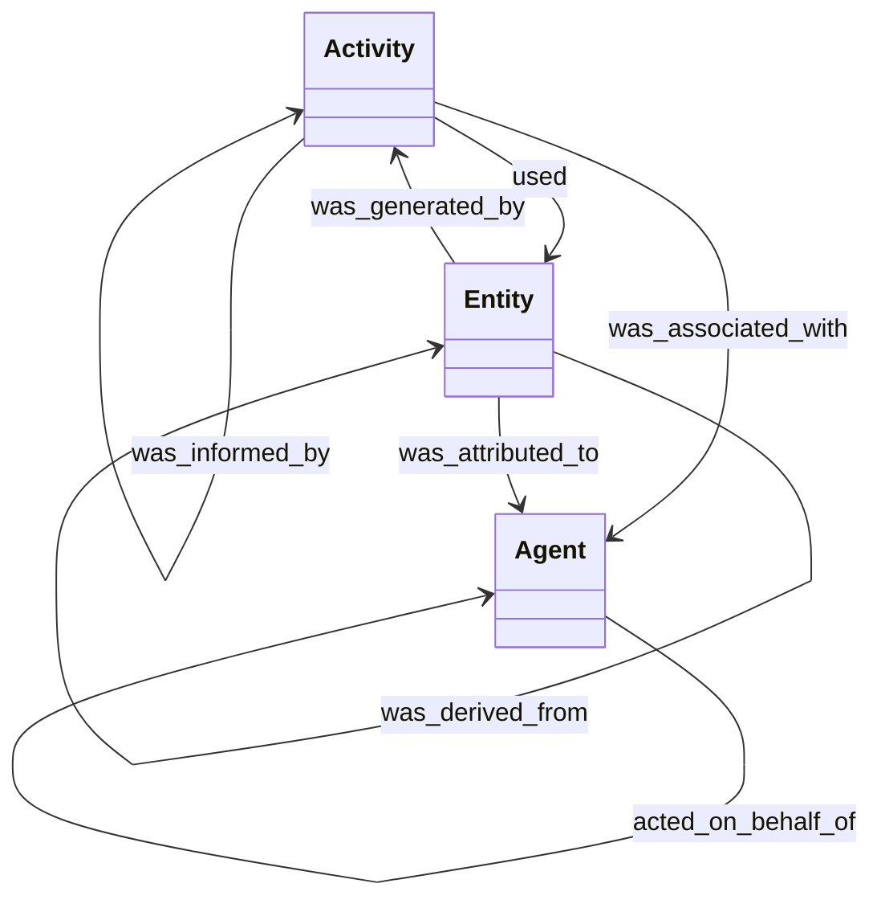
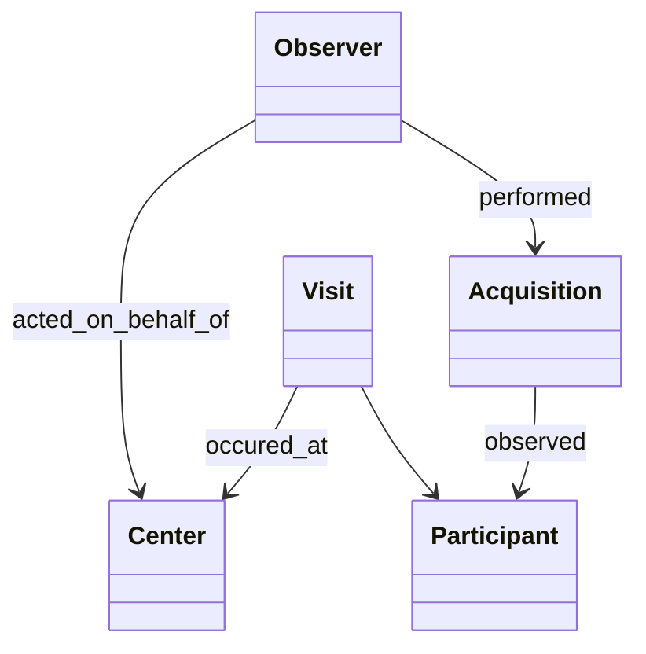
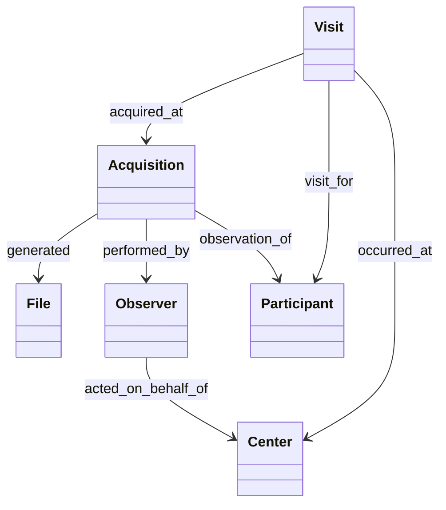

# Metadata

The following explains the design of the metadata used to describe data collections to be submitted to NACC.

The goal for the metadata given in NACC submissions is to reflect the provenance of the data that is submitted.
The *provenance* of a data file is a record of how that data was captured and the relationships describing that record.

## Provenance

We use the [PROV-DM](https://www.w3.org/TR/prov-dm/) model for describing provenance.
The objects in the model are *agents*, *activities* and *entities*.
Agents represent people, organizations or systems that perform activities that use an generate entities. 

Rather than go into detail on the relationships in the model, we describe the relationships we need for modeling the provenance of a data collection.

## Modeling Data Provenance

We use the following concepts to define the metadata.

|Concept|Provenance Type|Description|
|-------|---------------|-----------|
|Center|Agent|The site where data was collected|
|Observer|Agent|The person who collected the data|
|Participant|Entity|The person observed to collect the data|
|Visit|Activity|The participant's visit to the center for data collection|
|Acquisition|Activity|An individual collection of data|
|Data File|Entity|The data file containing the data collected by an acquisition

Using these concepts, what we are trying to model is the following description of a data collection:

> During a <ins>visit</ins> of <ins>participant</ins> to the <ins>center</ins>, an <ins>Observer</ins>, acting on behalf of the <ins>center</ins>, performed an (<ins>acquisition</ins>) activity that generated the <ins>data file</ins>

|Object|Object|Provenance Relationship|Otherwise known as|
|------|------|------------|--------------|
|Observer|Center|acted_on_behalf_of|
|Acquisition|Observer|was_associated_with|performed_by|
|Visit|Center|was_associated_with|occurred_at|
|Acquistition|Participant|used|observed|
|Visit|Participant|used|observed|
|Visit|Acquisition||consisted_of
|File|Acquisition|was_generated_by|

